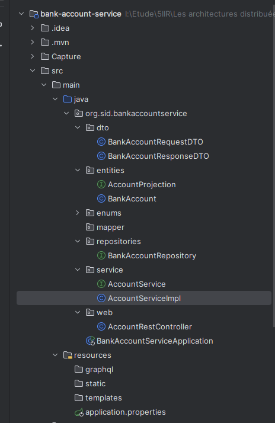

<h3>1. Créer un projet Spring Boot avec les dépendances Web, Spring Data JPA, H2, Lombok<h3>

<h3>2. Créer l'entité JPA Compte</h3>

<h3>3. Créer l'interface CompteRepository basée sur Spring Data</h3>

<h3>4. Tester la couche DAO</h3>
<h3>5. Créer le Web service Restfull qui permet de gérer des comptes
</h3>

<h3>6. Tester le web micro-service en utilisant un client REST comme Postman
</h3>

<h3>h2 database
</h3>

<h3>7. Générer et tester le documentation Swagger de des API Rest du Web service
</h3>

<h3>8. Exposer une API Restful en utilisant Spring Data Rest en exploitant des projections
</h3>

